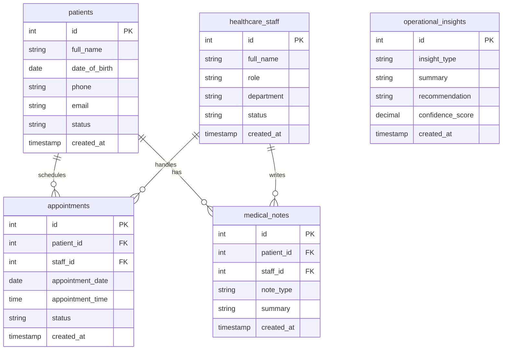

# Entity Relationship Diagram

```mermaid
erDiagram

    patients {
        int id PK
        string full_name
        date date_of_birth
        string phone
        string email
        string status
        timestamp created_at
    }

    healthcare_staff {
        int id PK
        string full_name
        string role
        string department
        string status
        timestamp created_at
    }

    appointments {
        int id PK
        int patient_id FK
        int staff_id FK
        date appointment_date
        time appointment_time
        string status
        timestamp created_at
    }

    medical_notes {
        int id PK
        int patient_id FK
        int staff_id FK
        string note_type
        string summary
        timestamp created_at
    }

    operational_insights {
        int id PK
        string insight_type
        string summary
        string recommendation
        decimal confidence_score
        timestamp created_at
    }

    patients ||--o{ appointments : schedules
    healthcare_staff ||--o{ appointments : handles
    patients ||--o{ medical_notes : has
    healthcare_staff ||--o{ medical_notes : writes
```
